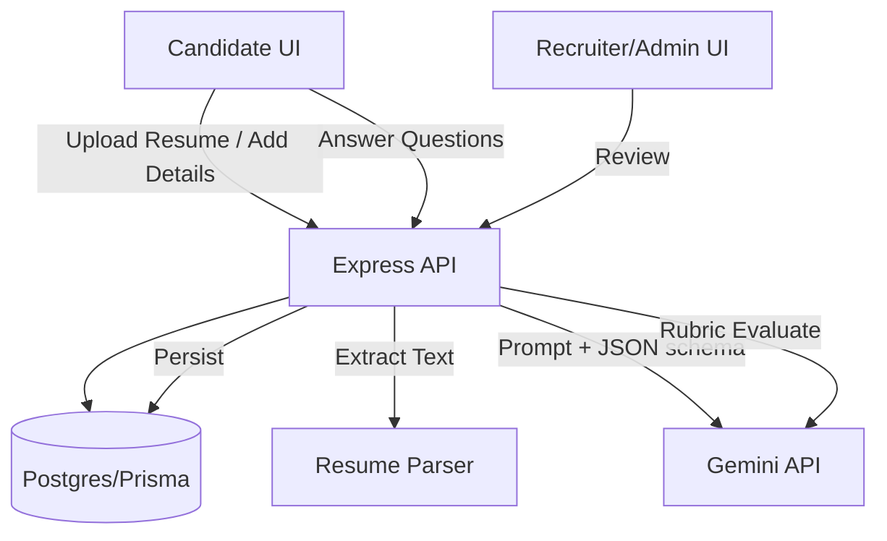

## Goals
- Generate 8–10 targeted interview questions per candidate using Gemini (free API key), based on resume text and/or saved profile data.
- Evaluate candidate answers with an LLM rubric and persist detailed feedback + scores.
- Support resume uploads in PDF/DOCX/TXT, handle Gemini failures safely, and stay within API quotas via rate limiting.

## High-Level Flow

## Database & Prisma Changes
- Extend existing models and add new ones in [schema.prisma](file:///c:/Users/siddh/Documents/Ai%20interview%20frontend/server/prisma/schema.prisma):
  - **Resume**: add `fileExt`, `extractedText` (nullable), `parsedAt` (nullable) so question generation can use normalized text.
  - **InterviewQuestion**: `id`, `interviewId`, `order`, `type` (TECH/CULTURE), `difficulty` (EASY/MEDIUM/HARD), `topic`, `question`, `expectedSignals` (JSON), timestamps.
  - **InterviewAnswer**: `id`, `interviewId`, `questionId`, `answerText`, `submittedAt`.
  - **InterviewAssessment** (or reuse InterviewFeedback with richer structure): store `rubricScores` (JSON), `strengths` (JSON/string), `improvements` (JSON/string), `overallScore`, `summary`, `modelInfo`.
  - **ApiUsageLog** (optional but recommended): track Gemini calls per user to enforce quotas more robustly than in-memory limits.
- Add indexes on `(interviewId, order)`, `(userId, createdAt)`, and status fields for fast queries.

## Backend Modules (Server)
### 1) Resume Parsing (PDF/DOCX/TXT)
- Update [resumes.ts](file:///c:/Users/siddh/Documents/Ai%20interview%20frontend/server/src/routes/resumes.ts) and the file validator to accept:
  - PDF: validate magic header `%PDF`.
  - DOCX: validate zip signature + extension and parse via a DOCX parser.
  - TXT: validate text/* and parse as UTF-8.
- Add a parser service that returns extracted plain text and sanitizes it (remove binary junk, normalize whitespace).
- Persist `extractedText` to DB at upload time (best UX) and/or async background parse on upload.

### 2) Gemini Client Wrapper (Server-side only)
- Create `server/src/llm/geminiClient.ts`:
  - Reads `GEMINI_API_KEY` from env (never exposed to frontend).
  - Uses fetch with timeout, retry/backoff on transient failures, and structured error mapping.
  - Logs model + token usage if available.
- Use JSON-only responses enforced by:
  - Strong prompting (“return valid JSON only”),
  - Runtime validation with Zod schemas (reject malformed outputs).

### 3) Rate Limiting & Resilience
- Add per-user rate limiting middleware for Gemini-powered endpoints:
  - Simple: in-memory token bucket keyed by `dbUser.id`.
  - Stronger: DB-backed usage log with rolling window.
- Add circuit-breaker style behavior:
  - If Gemini fails repeatedly, return a friendly error and allow retry later.
  - Optionally fall back to a small built-in question template set.

## REST API Endpoints
Add endpoints under the existing Clerk-protected `/api`:
- **Question Generation**
  - `POST /api/interviews/:id/questions/generate`
    - Inputs: `jobRoleId` (optional), `difficultyTarget` (optional), `questionCount` (8–10).
    - Uses candidate data (Profile + latest Resume.extractedText) to produce questions.
    - Persists InterviewQuestion rows.
- **Fetch Questions**
  - `GET /api/interviews/:id/questions`
- **Submit Answers**
  - `POST /api/interviews/:id/answers`
    - Inputs: list of `{ questionId, answerText }`.
    - Persists InterviewAnswer.
- **Generate Feedback**
  - `POST /api/interviews/:id/assessment/generate`
    - Uses questions + answers + candidate context.
    - Output includes: strengths, improvements, category scores (technical accuracy, communication, culture fit), and overall score.
    - Persists to InterviewAssessment (or InterviewFeedback.categoryScores + notes).

## LLM Prompting Strategy (Consistency + Relevance)
- Build a stable “candidate brief” object:
  - Role target (from JobRole), seniority estimate (from years/keywords), skills list, experience highlights.
- Question generation prompt enforces:
  - 8–10 questions, fixed distribution (e.g., 5 technical, 3 practical scenario, 2 culture/behavioral).
  - Difficulty anchored (e.g., medium by default) using explicit constraints.
  - Output schema includes difficulty/topic/expectedSignals per question.
- Feedback prompt uses a rubric:
  - Technical accuracy (0–100), communication clarity, depth, culture/ownership.
  - Requires evidence-based feedback referencing the candidate’s answer.

## Frontend UI Updates
- Resume upload page: allow PDF/DOCX/TXT (match backend) and show parsing status.
- Interview Room:
  - Add “Generate Questions” step.
  - Render generated questions list (8–10).
  - Capture answers (text input per question) and submit.
  - Trigger “Generate Feedback” and show results.
- Recruiter/Admin views:
  - Add an “Assessment” panel per interview to view questions, answers, and rubric breakdown.
- Extend [src/lib/api.ts](file:///c:/Users/siddh/Documents/Ai%20interview%20frontend/src/lib/api.ts) with new endpoints.

## Error Handling & Data Integrity
- Validate all inbound payloads with Zod on the server.
- Wrap multi-write operations in Prisma transactions:
  - Question generation: insert questions atomically.
  - Assessment generation: upsert assessment atomically.
- Return consistent API error shapes to the UI and show toast feedback.

## Testing
- Unit tests:
  - Resume parsing (pdf/docx/txt) text extraction.
  - Prompt builders and LLM-output Zod parsing.
  - Rate limiter behavior.
- Integration tests (Vitest + Supertest):
  - Endpoints with `SKIP_CLERK=true` and mocked Gemini client.
  - Verify DB writes and schema constraints.

## Configuration
- Add env vars:
  - `GEMINI_API_KEY=...`
  - Optional: `GEMINI_MODEL=gemini-1.5-flash` (or similar)
  - Rate limit settings: `GEMINI_RPM_PER_USER`, `GEMINI_RPD_PER_USER`

If you confirm this plan, I’ll implement it end-to-end (schema migrations, backend services/endpoints, UI flow, and tests) without exposing the Gemini key to the browser.